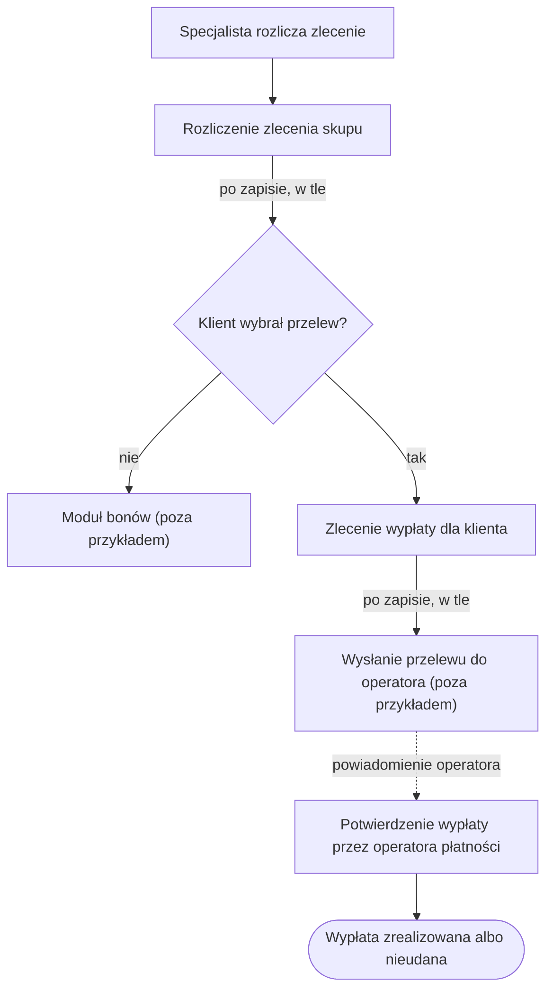

# Wypłata po rozliczeniu zlecenia skupu

> Strona generowana automatycznie z kodu. Nie edytuj jej. Uzupełnienia dodawaj w `Wyplata-po-rozliczeniu.notes.md`.

## Opis

Klient sprzedaje urządzenie, specjalista je wycenia, a klient akceptuje cenę. Po rozliczeniu zlecenia klient dostaje pieniądze przelewem albo bonem. Ta strona opisuje ścieżkę przelewu.

## Przebieg

| Krok | Proces | Moduł | Tryb |
|---|---|---|---|
| 1 | [Rozliczenie zlecenia skupu](../modules/Orders/use-cases/SettleOrder.md) | Orders | na żądanie specjalisty |
| 2 | [Start wypłaty po rozliczeniu zlecenia](../modules/Payments/use-cases/StartPayoutAfterSettlement.md) | Payments | w tle, po zapisie kroku 1 |
| 3 | [Zlecenie wypłaty dla klienta](../modules/Payments/use-cases/RequestPayout.md) | Payments | w tle, wywołane przez krok 2 |
| 4 | Wysłanie przelewu do operatora płatności | Payments | poza zakresem przykładu |
| 5 | [Potwierdzenie wypłaty przez operatora płatności](../modules/Payments/use-cases/ConfirmPayout.md) | Payments | na powiadomienie operatora |

## Gdzie proces może się zatrzymać bez widocznego błędu

Specjalista widzi sukces już po kroku 1. W tych miejscach klient nie dostanie przelewu, a nikt nie dostanie komunikatu o błędzie:

| Miejsce | Powód | Gdzie widać ślad |
|---|---|---|
| krok 2 | Klient wybrał bon. To zamierzone, bon obsługuje inny moduł. | forma wypłaty w zleceniu |
| krok 3, reguła 2 | Wypłaty są wyłączone w konfiguracji. | brak wypłaty, brak wpisu w logach |
| krok 3, reguła 3 | Dla zlecenia istnieje już wypłata oczekująca albo zrealizowana. | istniejąca wypłata |
| krok 3, reguły 1 i 4–7 | Błąd zlecenia wypłaty (konto zablokowane, brak KYC, brak IBAN, limit). Krok 2 tylko zapisuje ostrzeżenie w logach i nie ponawia. | ostrzeżenie w logach |
| krok 5 | Operator odrzucił przelew. Nic automatycznie nie tworzy nowej wypłaty. | wypłata ze statusem *Nieudana* |

---

## Szczegóły techniczne

| Krok | Wejście | Połączenie z kolejnym krokiem |
|---|---|---|
| 1 | `POST /orders/{orderId}/settle` → `SettleOrderCommand` | `Order.Settle` → `OrderSettledEvent` (domain event, po commicie) |
| 2 | `OrderSettledEventHandler` | `ISender.Send(RequestPayoutCommand)`, wynik tylko logowany |
| 3 | `RequestPayoutHandler` | `Payout.Create` → `PayoutRequestedEvent` (domain event, po commicie) |
| 4 | handler `PayoutRequestedEvent` (poza przykładem) | wywołanie zewnętrzne do operatora płatności |
| 5 | `POST /webhooks/psp/payouts` → `ConfirmPayoutCommand` | koniec procesu |

## Uwagi zespołu

(treść dołączana z `Wyplata-po-rozliczeniu.notes.md`, jeśli istnieje)
