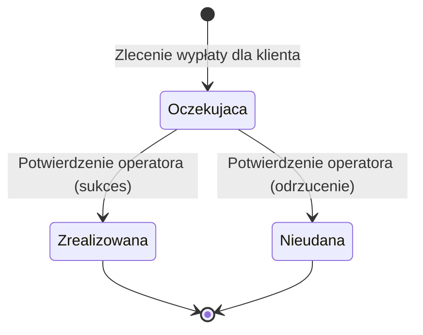

# Wypłata

> Strona generowana automatycznie z kodu. Nie edytuj jej. Uzupełnienia dodawaj w `Payout.notes.md`.

## Opis

Pojedynczy przelew pieniędzy do klienta za rozliczone zlecenie skupu. Dla jednego zlecenia może istnieć kilka wypłat, ale tylko jedna, która nie jest nieudana.

## Statusy

| Status | Znaczenie | Status końcowy |
|---|---|---|
| *Oczekująca* | Wypłata utworzona, czeka na wykonanie przelewu przez operatora płatności. | nie |
| *Zrealizowana* | Operator potwierdził wykonanie przelewu. | tak |
| *Nieudana* | Operator odrzucił przelew. Dla zlecenia można utworzyć nową wypłatę. | tak |

## Reguły

- Status można zmienić tylko z *Oczekująca*. Wypłata zrealizowana albo nieudana już się nie zmienia.
- Kwota nie może przekroczyć limitu jednej wypłaty (domyślnie 20 000).
- Numer konta jest kopią numeru z konta klienta w chwili utworzenia wypłaty.

## Kto zmienia wypłatę

| Zmiana | Proces |
|---|---|
| utworzenie (*Oczekująca*) | [Zlecenie wypłaty dla klienta](../use-cases/RequestPayout.md) |
| *Oczekująca* → *Zrealizowana* | [Potwierdzenie wypłaty przez operatora płatności](../use-cases/ConfirmPayout.md) |
| *Oczekująca* → *Nieudana* | [Potwierdzenie wypłaty przez operatora płatności](../use-cases/ConfirmPayout.md) |

---

## Szczegóły techniczne

| | |
|---|---|
| Klasa | `Payments.Domain.Payout` ([kod](https://git.example/skup/-/blob/a1b2c3d/src/Payments.Domain/Payments.cs#L28)) |
| Tabela | `payouts` |
| Eventy | `PayoutRequestedEvent` przy utworzeniu |

**Pola**

| Pole | Kolumna | Typ | Opis |
|---|---|---|---|
| `Id` | `id` | `Guid` | Identyfikator wypłaty. |
| `OrderId` | `order_id` | `Guid` | Zlecenie skupu, za które jest wypłata. |
| `CustomerId` | `customer_id` | `Guid` | Klient otrzymujący wypłatę. |
| `Amount` | `amount` | `decimal` | Kwota wypłaty. |
| `Iban` | `iban` | `string` | Numer konta skopiowany w chwili utworzenia. |
| `Status` | `status` | `PayoutStatus` | `Pending`, `Completed`, `Failed`. |
| `PspReference` | `psp_reference` | `string?` | Numer referencyjny przelewu od operatora, ustawiany przy sukcesie. |
| `FailureReason` | `failure_reason` | `string?` | Powód odrzucenia od operatora, ustawiany przy niepowodzeniu. |
| `CreatedAt` | `created_at` | `DateTime` | Data utworzenia (UTC). |

**Przejścia statusów w kodzie**

| Do | Metoda | Warunek | Miejsce |
|---|---|---|---|
| `Pending` | `Payout.Create` | `amount <= maxAmount` | [Payments.cs:57](https://git.example/skup/-/blob/a1b2c3d/src/Payments.Domain/Payments.cs#L57) |
| `Completed` | `MarkCompleted` | `Status == Pending` | [Payments.cs:69](https://git.example/skup/-/blob/a1b2c3d/src/Payments.Domain/Payments.cs#L69) |
| `Failed` | `MarkFailed` | `Status == Pending` | [Payments.cs:79](https://git.example/skup/-/blob/a1b2c3d/src/Payments.Domain/Payments.cs#L79) |

## Uwagi zespołu

(treść dołączana z `Payout.notes.md`, jeśli istnieje)
